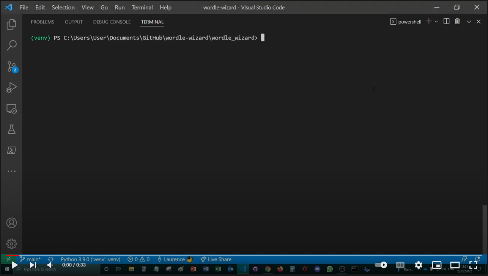

# Wordle Wizard

Wordle Wizard is a bot that can speed-solve Wordle puzzles. When called, she will open up a browser window, navigate to the Wordle homepage, and solve that day's problem in a few seconds.

She doesn't understand English, but has the full list of allowed words memorised and is really fast at maths.

Wordle Wizard is aware that she could cheat if she wanted to—by peeking at the source code on the Wordle site—but she chooses not to and plays just like you and me, by entering her best guesses using the buttons on the site.

Click on the video to see her in action:

<a href="https://www.youtube.com/watch?v=9IM0-dwC2Go"></a>

## Results

I'll keep a record of Wordle Wizard's results over the next few days in the table below, so check back if you want to see how she gets on!

| Date | Wordle Wizard | Laurence | Video |
| ------------- | ------------- | ------------- | ------------- |
| Sunday, 20 Feb 2022  | 4 | 4 | https://www.youtube.com/watch?v=9IM0-dwC2Go
| Monday, 21 Feb 2022  | 4 | 5 | https://www.youtube.com/watch?v=zUTqfyD5A0M


## How to use

I haven't been able to come up with a convenient way to make Wordle Wizard available for public consumption yet. Ideally I would like to set up a website where users can click a button and watch Wordle Wizard do her thing live, but I wasn't able to do this easily using Flask on Heroku as Heroku doesn't seem to support display servers like xvfb. Please get in touch if you have any ideas of a good/quick way to showcase the project other than posting screen captures to YouTube.

Those with Python and Google Chrome installed on their computers can run the program as follows:

1. Clone this repo.
2. Get the appropriate version of ChromeDriver for https://chromedriver.chromium.org/downloads and place the chromedriver.exe executable in the wordle_wizard directory.
3. Install the requirements in [requirements.txt](wordle_wizard/requirements.txt).
```
pip install -r requirements.txt
```
4. Run play_wordle.py
```
python play_wordle.py
```

## How it works/background to the project

The idea for Wordle Wizard came about when I was learning the selenium library in Python and started thinking of fun things to try doing with it. The code for manipulating the browser using selenium is in the WordleController class in [wordle_controller.py](wordle_wizard/wordle_controller.py).

The other part of the program is the algorithm for coming up with 'best' guesses each time based on the words currently available. This is implemented in the WordleGame class in [wordle_solver.py](wordle_wizard/wordle_solver.py). This is a naive first attempt and I have realised that it is not optimal—although this was not the original purpose of the project, I will be looking into this more in the coming weeks so stay tuned!

The two classes interact with each other in the main program, [play_wordle.py](wordle_wizard/play_wordle.py).