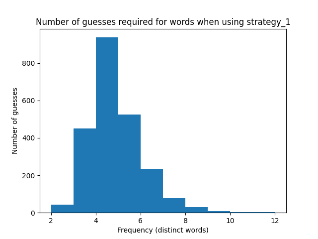
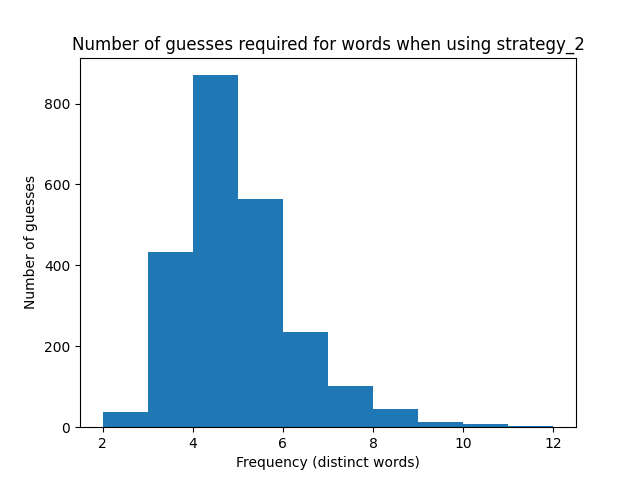

# Wordle Wizard

Wordle Wizard is a bot that can speed-solve Wordle puzzles. When called, she will open up a browser window, navigate to the Wordle homepage, and solve that day's problem in a few seconds.

She doesn't understand English, but has the full list of allowed words memorised and is really fast at maths.

Wordle Wizard is aware that she could cheat if she wanted to—by peeking at the source code on the Wordle site—but she chooses not to and plays just like you and me, by entering her best guesses using the buttons on the site.

Click on the video below to see her in action:

<a href="https://www.youtube.com/watch?v=9IM0-dwC2Go"></a>

## Results

I'll keep a record of Wordle Wizard's results over the next few days in the table below, so check back if you want to see how she gets on!

| Date | Wordle Wizard | Laurence | Video |
| ------------- | ------------- | ------------- | ------------- |
| Sunday, 20 Feb 2022  | 4 | 4 | https://www.youtube.com/watch?v=9IM0-dwC2Go
| Monday, 21 Feb 2022  | 4 | 5 | https://www.youtube.com/watch?v=zUTqfyD5A0M
| Tuesday, 22 Feb 2022 | 3 | 4 | https://www.youtube.com/watch?v=esiAA5-JRNc
| Thursday, 24 Feb 2022 | 3 | 4 | https://www.youtube.com/watch?v=_2NqWFJaOko
| Friday, 25 Feb 2022 | 4 | 6 | https://www.youtube.com/watch?v=4bKol7JxIfs
| Saturday, 26 Feb 2022 | 5 | 4 | https://www.youtube.com/watch?v=B2aKUmbFEnY

## How to use

I haven't been able to come up with a convenient way to make Wordle Wizard available for public consumption yet. Ideally I would like to set up a website where users can click a button and watch Wordle Wizard do her thing live, but I wasn't able to do this easily using Flask on Heroku as Heroku doesn't seem to support display servers like xvfb. Please get in touch if you have any ideas of a good/quick way to showcase the project other than posting screen captures to YouTube.

Those with Python and Google Chrome installed on their computers can run the program as follows:

1. Clone this repo.
2. Get the appropriate version of ChromeDriver for https://chromedriver.chromium.org/downloads and place the chromedriver.exe executable in the wordle_wizard directory.
3. Install the requirements in [requirements.txt](wordle_wizard/requirements.txt).
```
pip install -r requirements.txt
```
4. Run play_wordle.py
```
python play_wordle.py
```

## How it works

### Controlling the Wordle website using selenium

The idea for Wordle Wizard came about when I was learning the selenium library in Python and started thinking of fun things to try doing with it. The code for manipulating the browser using selenium is in the WordleController class in [wordle_controller.py](wordle_wizard/wordle_controller.py).

### Solving puzzles

The WordleSolver class is implemented in [wordle_solver.py](wordle_wizard/wordle_solver.py). It receives information about the feedback received from the game through the `update` method and uses this to track the game state and update the list of words available for the next guess, based on which it suggests the next word to play when called to by the `get_suggestion` method.

The original purpose of the project was just to practice selenium by controlling the Wordle website, so I did not put a lot of effort into the solving algorithm in the first instance, but became interested in improving Wordle Wizard's strategy after noticing that she did not perform much better than a human player. I added the an option to change the `strategy` as a parameter to the `__init__` method of the WordleSolver class and moved the business-end code for the `get_suggestion` method to a new module, [wordle_strategies](wordle_wizard/wordle_strategies.py). I also defined a new class, WordleSimulator, for playing the game with my own choice of starting word without opening the website, in [wordle_simulator.py](wordle_wizard/wordle_simulator.py), and wrote the code to collect and display information about each strategy in [wordle_evaluate.py](wordle_wizard/wordle_evaluate.py).

#### Strategy 1: Maximise sum of probabilities of letters in positions, avoid repeated letters

My original strategy was to find the probability of each letter occuring in each of the five positions based on frequencies among the remaining available words at each stage, sum these for each of the available words, and suggest the word for which the sum of the probabilities is the highest. Words with repeated letters (e.g. 'still', 'seven') are only suggested when there are no other words available, as they they give less information to go on for the next round. This strategy is reasonably reliable, producing a winning result for around 95% of words, but underperforms compared to humans for many words.

- Starting word: cares
- Highest number of guesses: 12 for word 'eater'  
cares ⇒  taker ⇒  water ⇒  pater ⇒  oater ⇒  mater ⇒  later ⇒  hater ⇒  gater ⇒  dater ⇒  rater ⇒  eater
- Win rate: 94.76%
- Mean: 4.39 guesses
- Standard deviation: 1.21 guesses

</img>

#### Strategy 2: Maximise sum of probabilities of letters regardless of position, avoid repeated letters

An alternative strategy is to look only at the overall probability of each letter, regardless of position. This way we are likely to lock in more letters in the first few guesses, though they are less likely to be in the correct position. It turns out that this strategy is actually slightly weaker than Strategy 1.

- Starting word: soare
- Highest number of guesses: 12 for word 'tight'  
soare ⇒  unity ⇒  gitch ⇒  wight ⇒  pight ⇒  might ⇒  light ⇒  kight ⇒  fight ⇒  dight ⇒  bight ⇒  tight
- Win rate: 92.59%
- Mean: 4.50 guesses
- Standard deviation: 1.30 guesses


<!-- 
#### Strategy 3: Maximise sum of probabilities of letters in positions, avoid repeated letters, and give a x1.5 reward to words in the top 10,000 words

https://norvig.com/ngrams/count_1w.txt -->